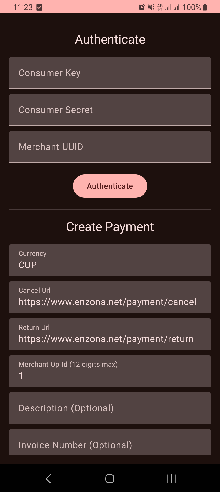

<div align="center">
  
  <h1>Enzona Payment Embedded</h1>
</div>
<p align="center">
 <a href="https://jitpack.io/#jdsdhp/enzona-payment-embedded"></a>
  <a href="https://opensource.org/licenses/Apache-2.0"></a>
  <a href="https://android-arsenal.com/api?level=21"></a>
  <a href=https://twitter.com/jdsdhp"></a>

<p align="center">  
💸️ The Enzona Payment Embedded is a lightweight Kotlin library designed to simplify integration with
the Enzona payment system in Android applications. This library is built on top of several
foundational libraries, including:

- [Gson](https://github.com/google/gson): A library for JSON serialization and deserialization.
- [OkHttp](https://github.com/square/okhttp): An HTTP client for making network requests.
- [Kotlin Coroutines](https://github.com/Kotlin/kotlinx.coroutines): A library for asynchronous
  programming in Kotlin using coroutines.

</p>

## Documentation

The development of this library was guided by
the [official Enzona API documentation](https://api.enzona.net/store/apis/info?name=PaymentAPI&version=v1.0.0&provider=admin),
which provides comprehensive information about the Enzona Payment API.

## Including in your project

#### Gradle

```gradle
dependencyResolutionManagement {
	repositoriesMode.set(RepositoriesMode.FAIL_ON_PROJECT_REPOS)
	repositories {
		mavenCentral()
		maven { url 'https://jitpack.io' }
	}
}

dependencies {
    implementation 'com.github.jdsdhp:enzona-payment-embedded:v0.1.0'
}
```

## Usage

### 1. Initialization

Initialize the Enzona Payment Embedded in your application by calling the `initialize` method.
Provide the appropriate values for the API URL, merchant consumer key, consumer secret, and merchant
UUID.

```kotlin
Enzona.getInstance().initialize(
    apiUrl = Enzona.ApiUrl.OFFICIAL,
    merchantConsumerKey = "your_consumer_key",
    merchantConsumerSecret = "your_consumer_secret",
    merchantUUID = "your_merchant_uuid",
)
```

> Note: The authentication step is optional and only required if you want to validate the data
> during initialization.

### 2. Authentication (Optional)

Authenticate using Enzona credentials by calling the `authenticate` method. This step is
particularly useful if you want to verify the validity of the provided merchant credentials.

```kotlin
val authenticationResult: ResultValue<Token> = Enzona.getInstance().authenticate()
```

> Note: Handling authentication errors is crucial for ensuring a secure integration.

### 3. Creating a Payment

Create a payment using the `createPayment` method. Provide details such
as `discount`, `shipping`, `tip` and other necessary parameters.

```kotlin
val paymentResult: ResultValue<Payment> = Enzona.getInstance().createPayment(
    discount = 10.0,
    shipping = 5.0,
    tip = 2.0,
    // ... other parameters
    items = listOf(item1, item2, item3)
)
```

### 4. Getting Payment Details

Retrieve payment details using the `getPaymentDetails` method with the `transaction_uuid`.

```kotlin
val paymentResult: ResultValue<Payment> = Enzona.getInstance().getPaymentDetails("transaction_uuid")
```

### 5.Cancelling a Payment

Cancel a payment using the `cancelPayment` method with the `transaction_uuid`.

```kotlin
val paymentResult: ResultValue<Payment> = Enzona.getInstance().cancelPayment("transaction_uuid")
```

### 5.Completing a Payment

Complete a payment using the `completePayment` method with the `transaction_uuid`.

```kotlin
val completeResult: ResultValue<Payment> = Enzona.getInstance().completePayment("transaction_uuid")
```

---
**Note: Ensure that you handle the asynchronous nature of some functions appropriately, as indicated
by the use of suspend in function signatures.**

## Sample project

It's very important to check out the sample app. Most techniques that you would want to implement
are already implemented in the examples.

View the sample app's source
code [here](https://github.com/jdsdhp/enzona-payment-embedded/tree/master/app)

 

## Upcoming Features

- Confirm a payment
- Obtain details of a refund
- Obtain a list of refunds
- Obtain a list of completed payments
- Perform checkout for a payment
- Create a receive code
- List refunds for a payment
- Pay for a product
- Create a payment order
- Initiate a payment refund

License
=======

    Copyright (c) 2024 jesusd0897.
    
    Licensed under the Apache License, Version 2.0 (the "License");
    you may not use this file except in compliance with the License.
    You may obtain a copy of the License at
    
        http://www.apache.org/licenses/LICENSE-2.0
    
    Unless required by applicable law or agreed to in writing, software
    distributed under the License is distributed on an "AS IS" BASIS,
    WITHOUT WARRANTIES OR CONDITIONS OF ANY KIND, either express or implied.
    See the License for the specific language governing permissions and
    limitations under the License.